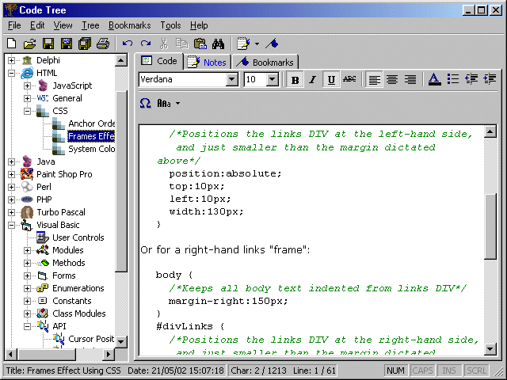



## Code Tree 2

### Description

This app stores code in text formats, and is represent via a tree view. I submitted a version before, but this has been re-written from scratch, and is a lot faster with more features and more codes. I only really uploaded it because I was asked to (see old submission). It's not finished or anything, but I hope you'll find it useful. I update the compiled version from time to time on my site (http://www.rickbull.co.uk/).

UPDATE: Finished the code for "Add New Section" and also started the code for showing the root node (so you can add a new section in the root, but that's not yet finished).
 
### More Info
 

             |
---                |---
**Submitted On**   |2002-12-15 13:49:34
**By**             |[Rick Bull](https://github.com/Planet-Source-Code/PSCIndex/blob/master/ByAuthor/rick-bull.md)
**Level**          |Intermediate
**User Rating**    |4.9 (88 globes from 18 users)
**Compatibility**  |VB 6\.0
**Category**       |[Complete Applications](https://github.com/Planet-Source-Code/PSCIndex/blob/master/ByCategory/complete-applications__1-27.md)
**World**          |[Visual Basic](https://github.com/Planet-Source-Code/PSCIndex/blob/master/ByWorld/visual-basic.md)
**Archive File**   |[Code\_Tree\_15201612292002\.zip](https://github.com/Planet-Source-Code/rick-bull-code-tree-2__1-41941/archive/master.zip)

